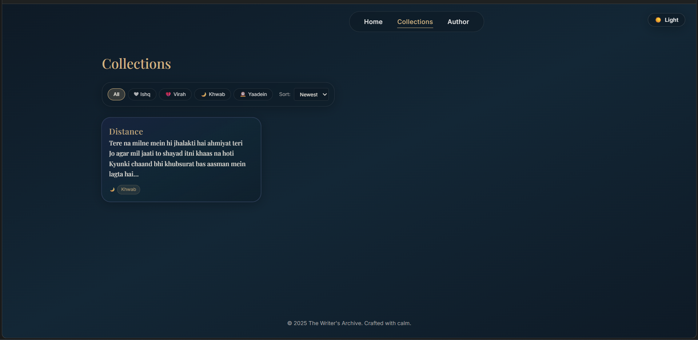
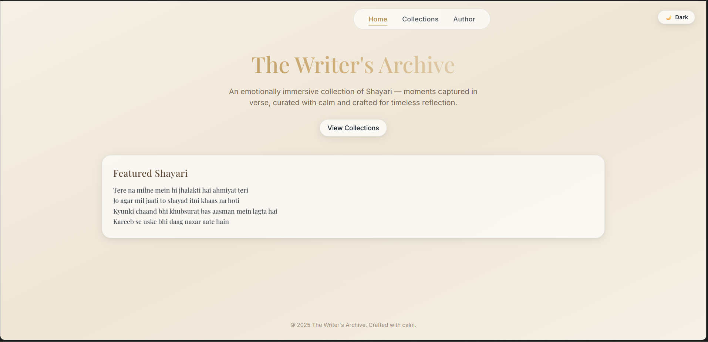
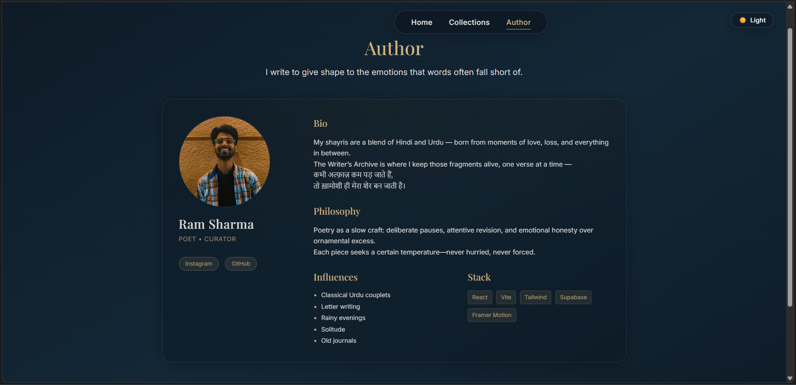

<div align="center">

# 🌙 The Writer's Archive
### *Where Words Find Their Home*

*"कभी अल्फ़ाज़ कम पड़ जाते हैं, तो ख़ामोशी ही मेरा शेर बन जाती है।"*

[](https://writers-archive.netlify.app)
[](https://github.com/sharmaram25/The-Writers-Archive/stargazers)

*An emotionally immersive digital sanctuary for Shayari*

</div>

---

## 🎭 *The Soul of Words*

In the quiet corners of the heart, where emotions take shape as verses, **The Writer's Archive** exists as a digital meditation on the art of Shayari. This isn't just a poetry collection—it's a living, breathing archive where each word carries the weight of whispered feelings and unspoken dreams.

Built with the same care as crafting a couplet, this platform bridges the timeless beauty of Urdu/Hindi poetry with the elegance of modern web design.

---

## 🌅 *Visual Journey Through Poetry*

### 🌙 **Midnight Verses** *(Dark Mode)*

<div align="center">

| **✨ Sanctuary of Words** | **� Collections of the Heart** |
|:---:|:---:|
|  |  |
| *Where featured Shayari whispers to visiting souls* | *Emotions categorized: Ishq, Virah, Khwab, Yaadein* |

</div>

### ☀️ **Dawn Reflections** *(Light Mode)*

<div align="center">

| **🌅 Parchment Dreams** | **👨‍🎨 The Poet's Story** |
|:---:|:---:|
|  |  |
| *Warm paper textures embrace each verse* | *Know the mind behind the metaphors* |

</div>

---

## � *Features That Breathe Life Into Words*

```
🏠 Sanctuary Homepage
   └── Random featured Shayari, chosen by serendipity
   └── Atmospheric landing that whispers rather than shouts
   
📚 Curated Collections  
   ├── Ishq (इश्क़) - Love in all its colors
   ├── Virah (विरह) - The ache of separation  
   ├── Khwab (ख्वाब) - Dreams that refuse to fade
   └── Yaadein (यादें) - Memories etched in verse
   
👨‍� Author's Chronicle
   └── Personal philosophy on the craft of words
   └── Creative influences and inspirations
   
🔐 Hidden Sanctum (Admin)
   └── Content management for the curator
   └── Accessible via the secret path: /admin
```

---

## 🎨 *The Aesthetic Philosophy*

### **Glassmorphism: Where Light Meets Poetry**
- **Translucent panels** that float like thoughts
- **Backdrop blur** creating depth and mystery  
- **Soft shadows** that give weight to weightless words
- **Paper textures** in light mode, honoring traditional manuscripts

### **Typography: The Voice of Silence**
- **Serif fonts** for poetry—each character carries emotion
- **Sans-serif** for navigation—clean, unobtrusive guidance
- **Careful spacing** that lets each word breathe

### **Colors That Speak**
- **🌙 Dark Mode**: Deep blues of midnight contemplation, gold like lamplight on paper
- **☀️ Light Mode**: Warm parchment and brass, like aged poetry journals
- **Emotional resonance** in every shade chosen

---

## 🛠️ *Crafted With Modern Artistry*

<div align="center">

| **Frontend Poetry** | **Backend Harmony** | **Performance Grace** |
|:---:|:---:|:---:|
| ⚛️ React 18.3.1 | 🗄️ Supabase Database | 🔨 Vite Build Tool |
| 🎨 TailwindCSS | 🔐 Row Level Security | 📱 Mobile-First Design |
| 🎭 Framer Motion | ☁️ Real-time Updates | 🌙 Dual Theme System |
| 🧭 React Router | 🚀 Cloud Infrastructure | ✨ Smooth Animations |

</div>

---

## 🌱 *Nurturing Your Own Archive*

### **Prerequisites for Poetry**
- Node.js (v16+) - *The foundation*
- Supabase account - *The sanctuary for your words*
- A heart full of verses - *The most essential ingredient*

### **Planting the Seeds**

```bash
# Clone this digital garden
git clone https://github.com/sharmaram25/The-Writers-Archive.git
cd The-Writers-Archive

# Nurture with dependencies  
npm install

# Create your environment sanctuary
cp .env.example .env.local
```

### **Configuring Your Sanctuary**

Edit `.env.local` with your Supabase credentials:
```env
VITE_SUPABASE_URL=https://your-project-sanctuary.supabase.co
VITE_SUPABASE_ANON_KEY=your-key-to-the-archive
```

### **Awakening the Archive**

```bash
# Breathe life into the development server
npm run dev

# Build for the world to read
npm run build

# Preview your creation
npm run preview
```

---

## � *Sharing Your Poetry With The World*

### **Netlify Deployment** *(Recommended)*
The archive is configured to deploy seamlessly on Netlify:

1. Connect your repository to Netlify
2. The build settings are already configured in `netlify.toml`
3. Add your environment variables
4. Watch your poetry come alive on the web

---

## 📁 *The Architecture of Emotion*

```
The Writer's Archive/
├── 🎭 src/components/
│   ├── 💫 SharedUI/           # Buttons, loaders, toasts
│   ├── 🛡️ ErrorBoundary.jsx  # Graceful error handling  
│   ├── 🧭 Navbar.jsx         # Navigation with elegance
│   ├── 📖 ShayriCard.jsx     # Poetry presentation
│   ├── 🌙 ThemeToggle.jsx    # Light/dark ambiance
│   └── 🪟 Modal.jsx          # Immersive reading
│
├── � src/pages/
│   ├── 🏠 Home.jsx           # The welcoming sanctuary
│   ├── 📚 Collections.jsx    # Gallery of emotions
│   ├── 👤 About.jsx          # The poet's story  
│   └── 🔐 Admin.jsx          # Content curation
│
├── 🎨 src/styles/           # Visual poetry in CSS
├── � src/context/          # State that flows like verse
└── ⚡ src/supabase/         # Database connection
```

---

## 🤝 *Contributing to the Art*

This archive welcomes improvements that honor its artistic vision:

```bash
git checkout -b feature/enhance-poetry
# Make your thoughtful changes
git commit -m "✨ Enhance the poetry experience"
git push origin feature/enhance-poetry
```

*Create a Pull Request with the same care you'd review a poem.*

---

## � *License & Legacy*

This project flows under the **MIT License** - the code is free as poetry should be.

**However:** The Shayari within these digital pages remains the intellectual property of **Ram Sharma**. They are not covered by the MIT license, for a poet's words belong to their heart.

---

## 👨‍🎨 *The Architect of Words*

<div align="center">

**Ram Sharma**  
*Poet • Developer • Digital Craftsman*

[](https://github.com/sharmaram25)
[](https://www.instagram.com/ramsharma.25)

*"I write to give shape to the emotions that words often fall short of."*

</div>

---

## 🙏 *Inspirations & Acknowledgments*

- **Classical Urdu Poetry** - The eternal wellspring of inspiration
- **Digital Minimalism** - Less noise, more signal
- **Glassmorphism Design** - Beauty in translucency  
- **React Ecosystem** - Tools that empower creativity
- **Supabase** - Backend that doesn't interrupt the flow
- **The Reader** - You, who gives life to these words

---

<div align="center">

## ⭐ *If These Words Moved You*

**Star this repository and let poetry find more hearts**

*"Silence is the page before the first line."*

---

*Crafted with ❤️ and countless cups of tea*  
*© 2025 The Writer's Archive*

</div>